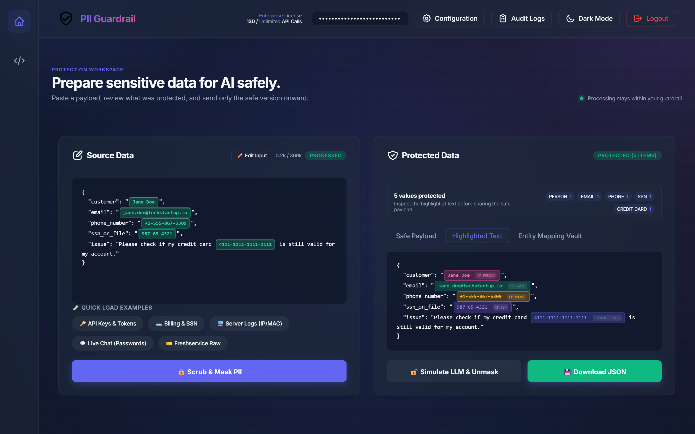
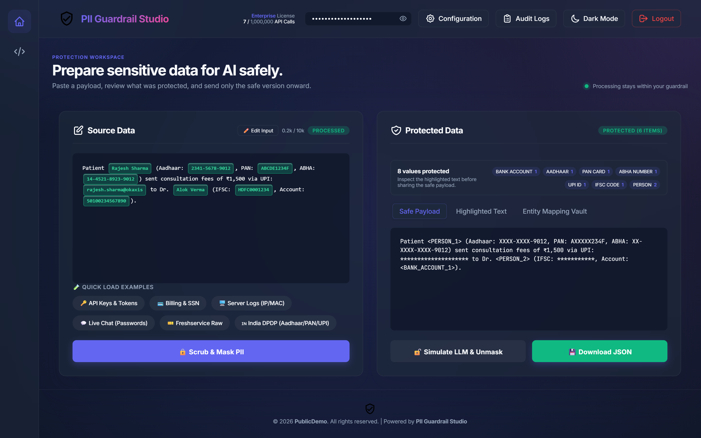
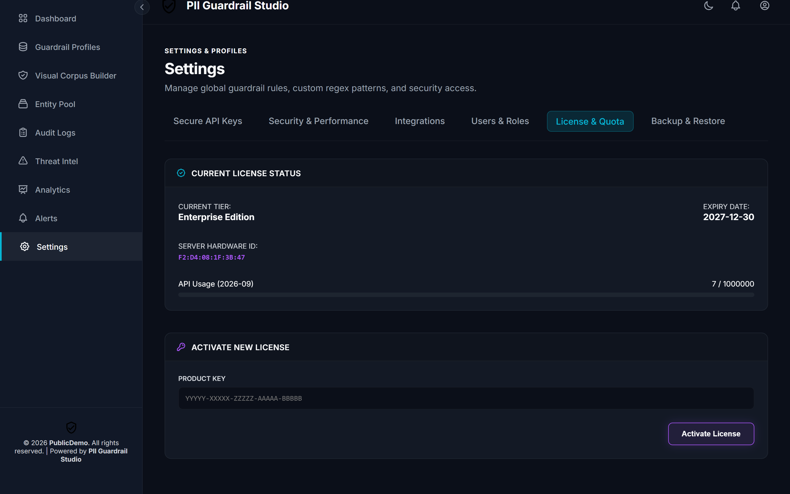
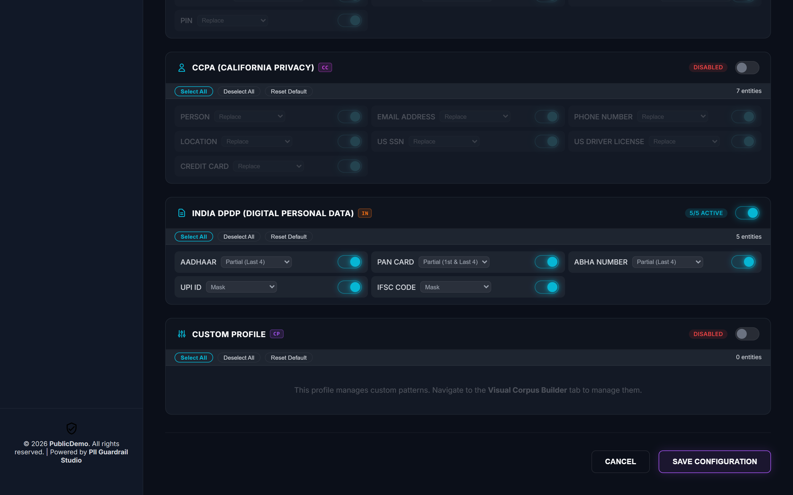
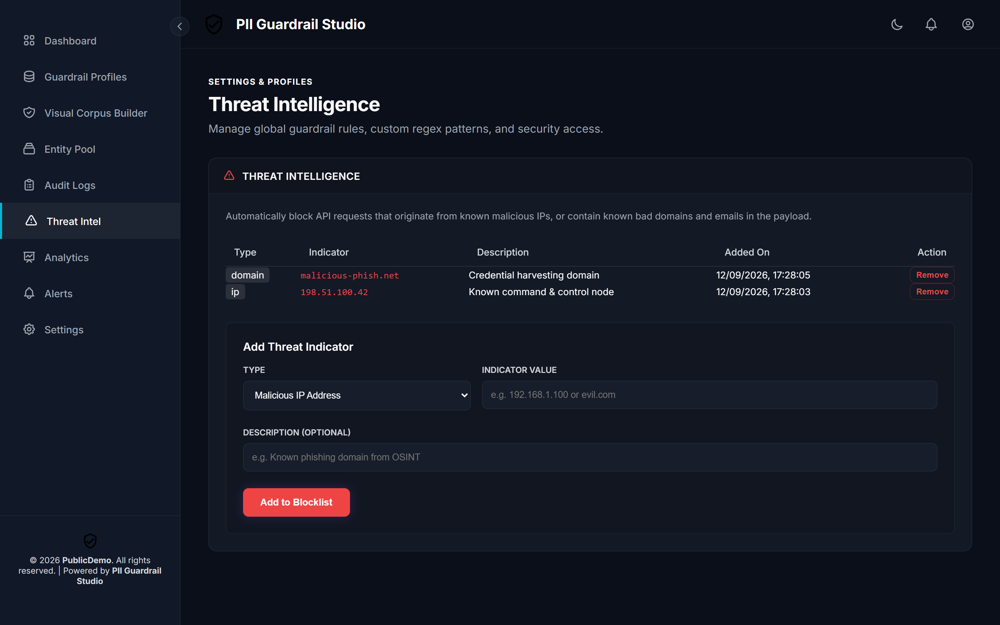
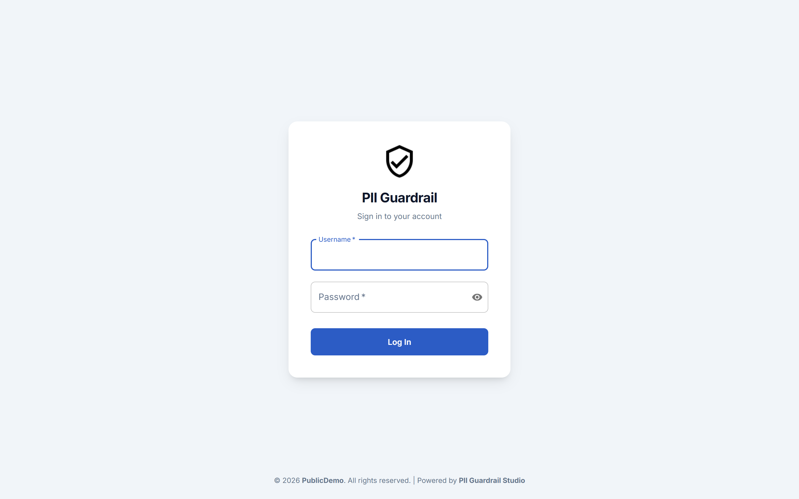
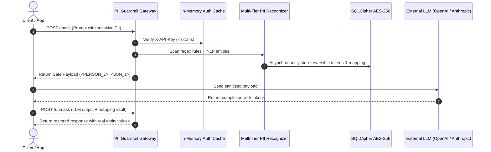

<div align="center">

# 🛡️ Enterprise PII Guardrails Studio (v2.0.7)

**High-Performance, Zero-Leak AI Privacy Gateway & Management Studio for Enterprise LLM Pipelines**

[](https://pypi.org/project/piiguardrails/)
[](https://pypi.org/project/piiguardrails/)
[](https://github.com/piiguardrails/piiguardrails)
[](https://hub.docker.com/r/piiguardrails/enterprise-pii-guardrail)
[](https://github.com/piiguardrails/piiguardrails)

[](https://pypi.org/project/piiguardrails/)
[](https://github.com/piiguardrails/piiguardrails)
[](https://github.com/piiguardrails/piiguardrails)
[](https://pypi.org/project/piiguardrails/)
[](LICENSE)

<br/>

[**PyPI Package**](https://pypi.org/project/piiguardrails/) • [**API Reference**](docs/API_REFERENCE.md) • [**Licensing & Node-Locking**](LICENSING_GUIDE.md) • [**Disaster Recovery**](docs/BACKUP_AND_DISASTER_RECOVERY.md) • [**Report Issue**](https://github.com/piiguardrails/piiguardrails/issues)

</div>

---

## 📸 The Enterprise Studio in Action

### Interactive PII Playground (Live Detection with Visual Highlight Pills)
Inspect, scrub, and redact sensitive entities with sub-25ms latency. Visual badge pills pinpoint exactly what the engine detected before it ever leaves your network.



<br/>

<details>
<summary><b>🔍 Expand to View Additional Studio Screenshots</b></summary>

<br/>

#### 1. Deterministic Safe Payload Output (`/mask`)
Transformed prompt ready for LLM consumption with reversible placeholder tokens (`<PERSON_1>`, `<SSN_1>`, `<CREDIT_CARD_1>`).



#### 2. Node-Locked Enterprise Licensing & Hardware ID Management
Cryptographically bound to your server hardware using Ed25519 signatures with zero external network phone-home requirement.



#### 3. 30+ Entity Recognizers & Compliance Profiles (HIPAA, GDPR, India DPDP)
Granular toggles for Financial, Healthcare, IT Security, Core PII, and statutory regional compliance—including the turnkey **India DPDP Act (2023)** profile with UIDAI Masked Aadhaar (`XXXX-XXXX-1234`), PAN Card, ABHA Health ID, UPI VPA, and IFSC Code.



#### 4. Real-Time Threat Intelligence & IoC Shield
Interception firewall blocking malicious IP addresses, phishing domains, and credential leaks before evaluation.



#### 5. Enterprise Authentication Portal
Encrypted session management, role-based access control, and customizable enterprise branding.



</details>

---

## ⚡ Overview

**Enterprise PII Guardrails Studio** is an ultra-fast, defense-in-depth privacy gateway designed to intercept, detect, mask, and pseudonymize Personally Identifiable Information (PII) before it reaches third-party LLM APIs (OpenAI, Anthropic, Google Gemini, Azure OpenAI) or internal vector databases.

### Why Enterprise Engineering Teams Choose This Gateway:
- **Sub-25ms Live Masking**: In-memory LRU authorization cache and non-blocking asynchronous audit pipeline.
- **Turnkey Statutory Regulatory Profiles**: 1-click baseline protection for **HIPAA**, **GDPR**, **PCI-DSS v4.0**, and **India DPDP Act (2023)** (with UIDAI Aadhaar, PAN, ABHA, UPI, and IFSC support).
- **Zero-Leak Guarantee at Rest**: Database, API keys, and audit logs are encrypted using **SQLCipher AES-256-CBC**.
- **SHA-256 Cryptographic Verification**: Every downloaded runtime engine is verified on the fly against official SHA-256 hashes prior to execution.
- **Node-Locked Licensing (v4)**: Commercial licenses are cryptographically locked to the host's **Server Hardware ID** via Ed25519 asymmetric signatures—operating 100% offline with zero cloud dependency.
- **Bi-Directional Token Restoration**: Effortlessly restore LLM responses (`/unmask`) back to original values for authorized end users.

---

## 🔄 How It Works (Zero-Trust Pipeline)



---

## 🚀 Quickstart

### Method 1: Using `pip` (Recommended)

```bash
# 1. Install the official PyPI package
pip install piiguardrails

# 2. Launch the studio
piiguardrails
```

On first launch, `piiguardrails` automatically streams the core binary, verifies its **SHA-256 cryptographic checksum**, provisions your encrypted database, and opens the studio dashboard on:
👉 **`http://localhost:8000`**

---

### Method 2: Using `uv` (Instant Sandbox — Zero Setup)

Run in an isolated environment without modifying global Python:

```bash
uv run --with piiguardrails piiguardrails
```

---

### Method 3: Standalone Pre-Compiled Executable

For restricted air-gapped environments without Python installed, download the standalone binary directly from [GitHub Releases](https://github.com/piiguardrails/piiguardrails/releases):

- **Windows x64**: `EnterprisePIIGuardrail-v2.0.7-windows-x64.exe`
  - *SHA-256*: `64dfa6af6893a24b33dd8bbca263b494c1f2a953462a4ac8134ac4a2b22a806c`
- **Linux x86_64**: `EnterprisePIIGuardrail-v2.0.7-linux-x86_64`
  - *SHA-256*: `556b18841a9b60337c21e68d2a9f3ed9b01db75a2ea74e93c7bcef1af63ee075`

Run directly:
```bash
# Linux
chmod +x EnterprisePIIGuardrail-v2.0.7-linux-x86_64
./EnterprisePIIGuardrail-v2.0.7-linux-x86_64

# Windows
.\EnterprisePIIGuardrail-v2.0.7-windows-x64.exe
```

---

### Method 4: Docker / Podman Deployment

```bash
docker run -d \
  -p 8000:8000 \
  -v $(pwd)/data:/app/data \
  -e SQLCIPHER_PASSPHRASE="your-secure-passphrase-min-32-chars!" \
  --name pii-guardrail-studio \
  piiguardrails/enterprise-pii-guardrail:latest
```

---

## 🎁 Community Launch Promo: 6 Months Free Enterprise

To celebrate the v2.0 release, community developers and enterprise teams can activate a full **Enterprise Tier** evaluation license (unlimited requests, unrestricted payload length, all 30+ entity recognizers, and custom regex builder) valid through **March 31, 2027**:

```text
ED3-AMBGXK7UVD777777-GRYXEUYUZ432JOHY-UWVDBHXRLAXU4U47-7MBK2DQGIUV4JQT6-UJNRXNTHI3JPBGIS-P66HGKVYNLMQXHHS-M3N4RF3XDN6LZILT-WQNCGJ4KEY6ONIIM
```

### How to Activate:
1. Open your studio dashboard at `http://localhost:8000`.
2. Click **Settings** in the left sidebar and open the **License & Quota** tab.
3. Paste the product key into the activation field and click **Activate License**.

---

## 🧩 3-Line Python Integration

Once the gateway is running, integrate it seamlessly into LangChain, LlamaIndex, or any Python LLM pipeline:

```python
import requests

API_URL = "http://localhost:8000"
HEADERS = {"X-API-Key": "your-api-key-here", "Content-Type": "application/json"}

# 1. Mask sensitive input before sending to LLM
raw_prompt = "Patient Alice Walker (SSN: 987-65-4321, Phone: 555-019-2834) prescribed Amoxicillin."
mask_res = requests.post(f"{API_URL}/mask", json={"text": raw_prompt}, headers=HEADERS).json()

safe_prompt = mask_res["masked_text"]
# Result: "Patient <PERSON_1> (SSN: <SSN_1>, Phone: <PHONE_1>) prescribed Amoxicillin."

# 2. Query your LLM with the sanitized prompt
# simulated_llm_reply = "Dosage for <PERSON_1> (SSN: <SSN_1>) is 500mg daily. Contact <PHONE_1> for refill."

# 3. Restore LLM output back to real patient data for authorized staff
unmask_res = requests.post(f"{API_URL}/unmask", json={
    "text": "Dosage for <PERSON_1> (SSN: <SSN_1>) is 500mg daily. Contact <PHONE_1> for refill.",
    "mapping": mask_res["mapping"]
}, headers=HEADERS).json()

print(unmask_res["unmasked_text"])
# Output: "Dosage for Alice Walker (SSN: 987-65-4321) is 500mg daily. Contact 555-019-2834 for refill."
```

---

## 🛡️ Enterprise Feature Matrix

| Capability | Community Promo / Trial | Standard Tier | Enterprise Tier |
| :--- | :---: | :---: | :---: |
| **Masking Latency** | **< 25ms** | **< 25ms** | **< 25ms** |
| **Pre-built Entity Recognizers** | 30+ Included | 30+ Included | 30+ Included |
| **Custom Regex Engine** | 2 Patterns | 5 Patterns | **Unlimited** |
| **Max Payload Size** | 5,000 chars | 50,000 chars | **Unrestricted** |
| **Monthly API Quota** | 1,000 reqs | 20,000 reqs | **Unlimited** |
| **Storage Security** | SQLCipher AES-256 | SQLCipher AES-256 | **SQLCipher AES-256** |
| **Licensing Mode** | Version 3 Floating | Version 3 Floating | **Version 4 Node-Locked (`--hwid`)** |
| **Threat Intelligence Shield** | ✅ Included | ✅ Included | ✅ Included |
| **Audit Logging & Retention** | ✅ Included | ✅ Included | ✅ Included |

---

## 📚 Complete Documentation Index

- 📖 **[API Reference Specification](docs/API_REFERENCE.md)**: Full OpenAPI / REST documentation with request/response schemas for `/mask`, `/unmask`, `/health`, and Admin endpoints.
- 🔑 **[Customer Licensing Guide](LICENSING_GUIDE.md)**: Guide on tiers, obtaining your Server Hardware ID, and activating enterprise keys offline.
- 💾 **[Backup & Disaster Recovery Guide](docs/BACKUP_AND_DISASTER_RECOVERY.md)**: Database persistence, `.env` encryption passphrase management, and server migration.

---

## 📋 System Requirements

- **Operating System**: Windows 10/11/Server (64-bit) or Linux (Ubuntu, Debian, RHEL, CentOS, Rocky, WSL2 x86_64)
- **Python**: `>= 3.8` (if running via `pip` / `uv`)
- **Memory**: Minimum 2 GB RAM (4 GB recommended for high throughput)
- **Network Port**: Default `8000` (configurable via `--port` or `.env`)

---

## 📄 License

This software is governed by the [Enterprise Evaluation and Commercial License Agreement](LICENSE). All rights reserved.
